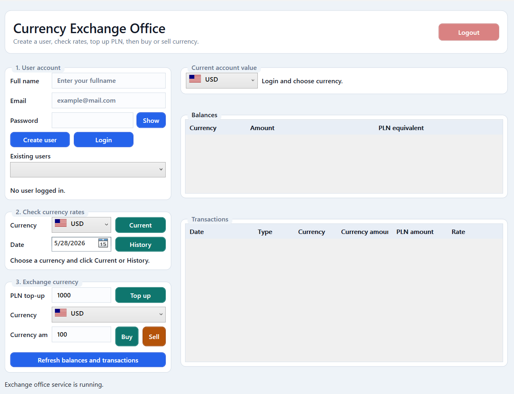
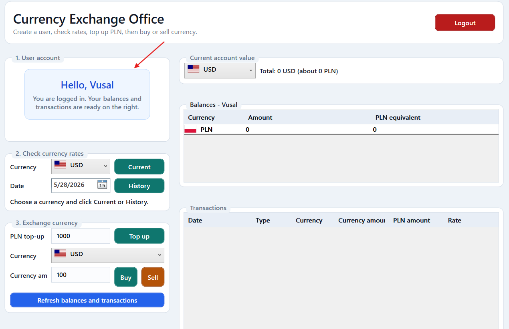
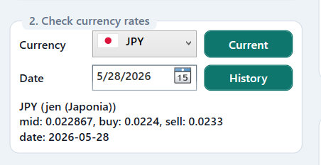
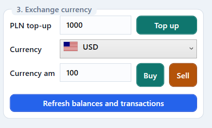
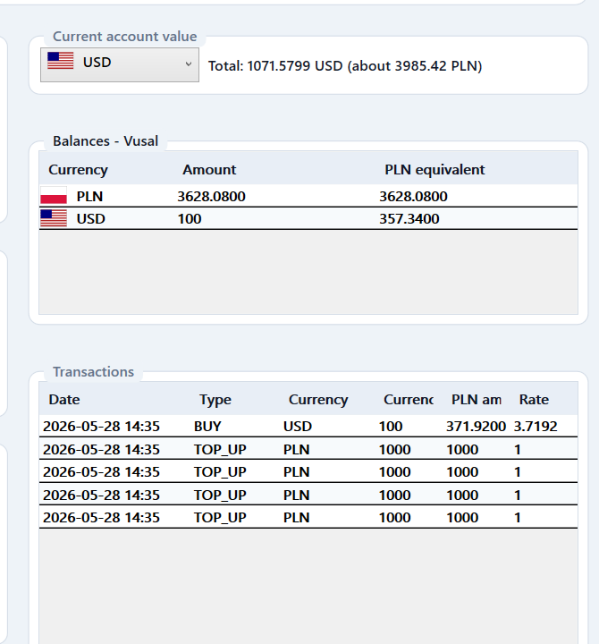
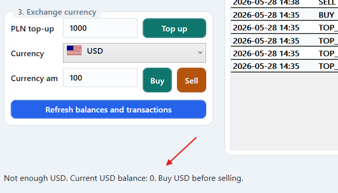
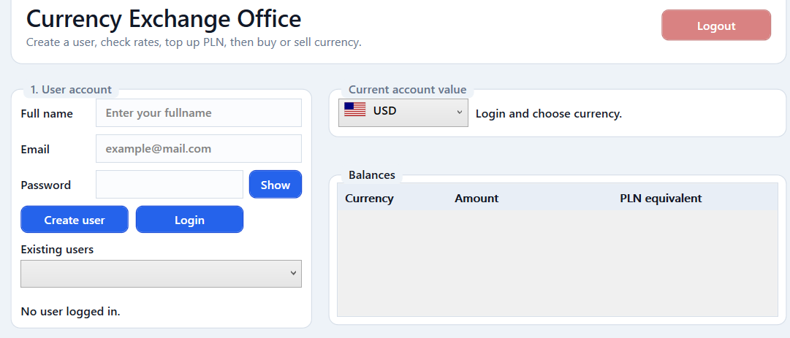

### App view:

### You can Create your account and login easily:

### In Check currency rates you can chech the current and old currency rates:

### In Exchange currency field you can Top Up your account by PL or you can buy, sell another currencies how you want:

### if you bought any currency it will be added to your account and will show your balances seperatedly. Also in Upperside it will show the total account value, and the eqauavalient of this in PL. 

### On Transactions filed it will show your transactions history.

#### If you haven't got enough balance to sell the currency, it will notify you:

### On Upperside there is logout button to log out from the account. When you click it it deletes the infos about your account balance, and require login.

